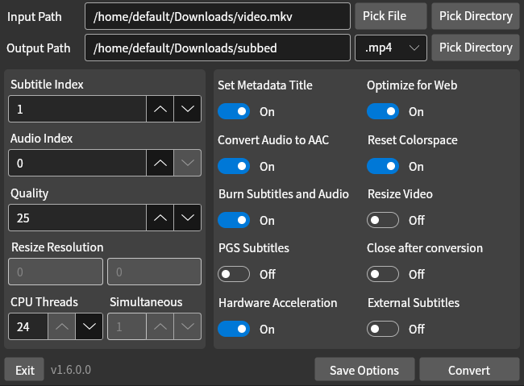

# HardSubberGUI

This is a simple cross platform GUI tool made with Avalonia used to burn subtitles into a video using ffmpeg.

### Usage
* Start the executable (available optional input path parameter)

### Installation
* Build the project or download latest release

### Hardware Acceleration
- [ ] Linux
  - [x] AMD (v1.0.1.0+)
  - [ ] NVIDIA
  - [ ] Intel
- [x] Windows
  - [x] AMD (v1.3.0.0+)
  - [x] NVIDIA (v1.2.0.0+)
  - [ ] Intel

### Notes
* ffmpeg is required for hardsubbing. If it's not installed already, hardsubber will download it and use it locally
