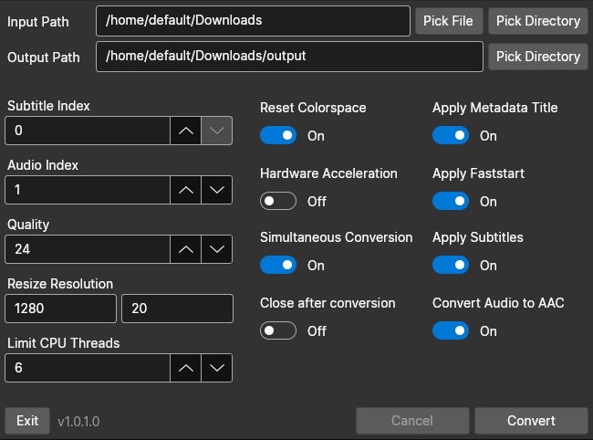

# HardSubberGUI

This is a simple GUI tool made with Avalonia used to burn subtitles into a video using ffmpeg.

### Usage
* Start the executable (available optional input path parameter)

### Installation
* Build the project or download latest release

### Notes
* Hardware acceleration only implemented for amdgpu on linux
* ffmpeg is required for hardsubbing. If it's not installed already, hardsubber will download it and use it locally
